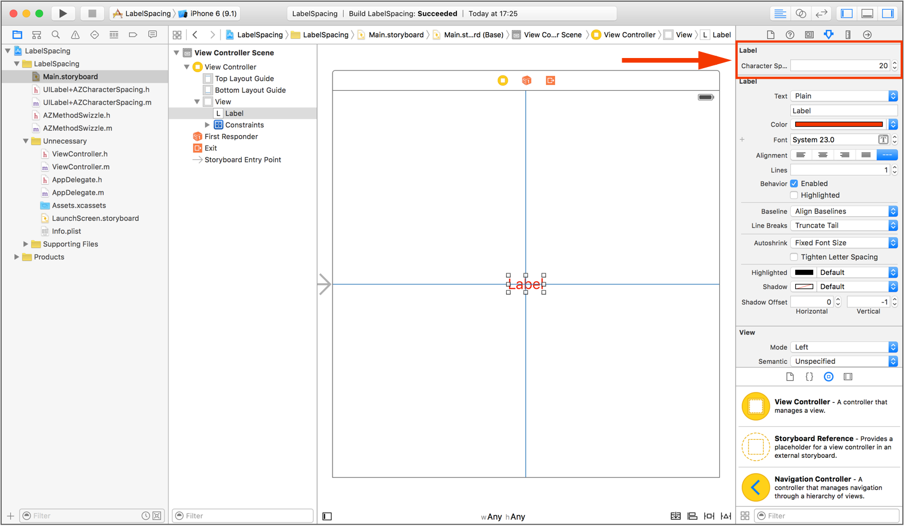
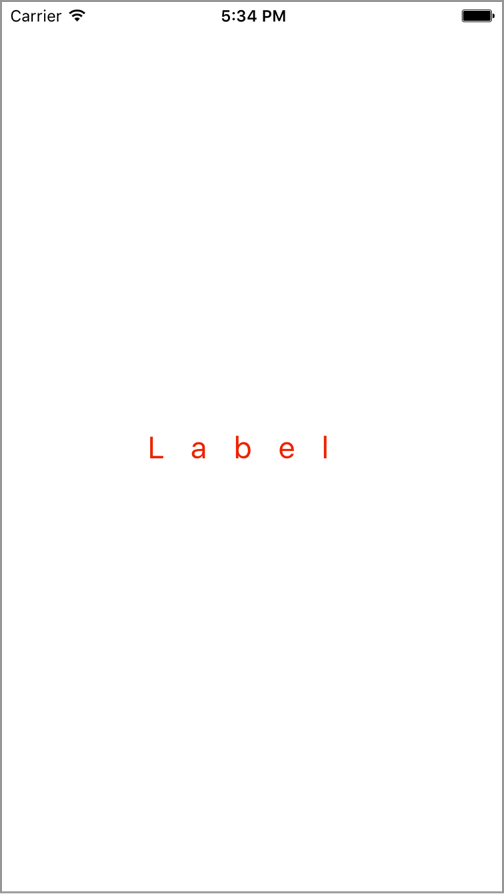

# AZLabelCharecterSpacing
Easy change character spacing in `UILabel`

## Installation

- Add the following to your [`Podfile`](http://cocoapods.org/) and run `pod update`
```
    pod 'AZLabelSpacing'
```
- or add the following to your [`Cartfile`](https://github.com/Carthage/Carthage) and run `carthage update`
```
    github "azimin/AZLabelCharecterSpacing"
```
- or clone as a git submodule,

- or just copy files in the ```AZLabelSpacing``` folder into your project.

## Example

For example in Storyboard it will be:



Result will be:


